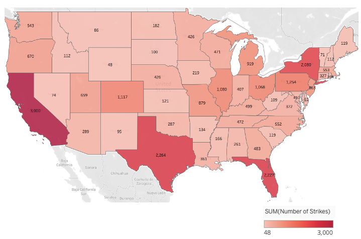
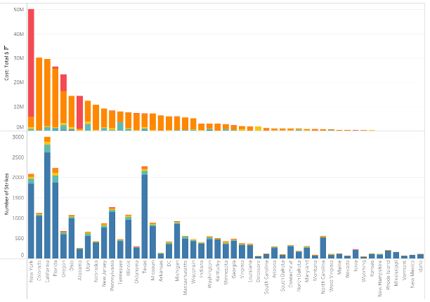
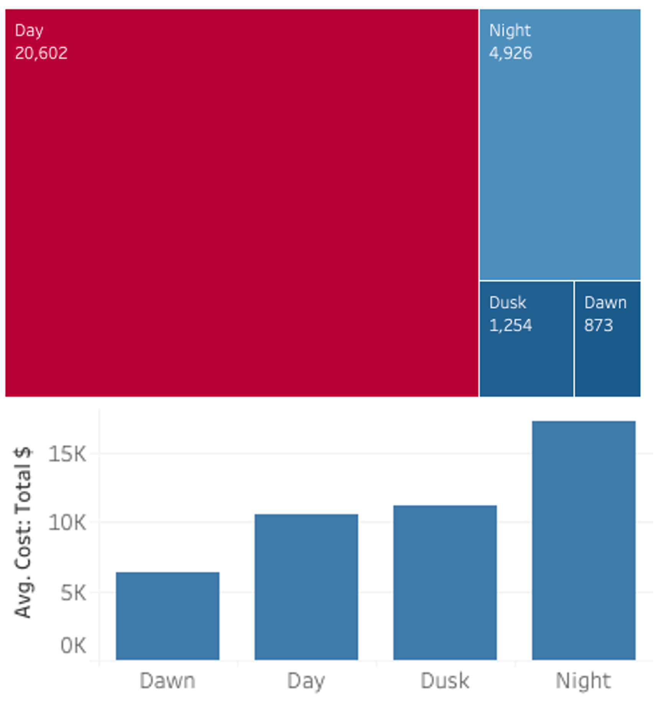

# Final Project Tableau

## Goals

- Analyze the dataset FAA Wildlife Strikes, 2015 and review its cost impact.
- Create visualization in Tableau with key details
- Find patterns and trends related to the strikes and wildlife
- Create a dashboard to answer questions related to the dataset

## Process

1. Dataset analysis
2. Identify questions that could be answered with the available data.
3. Build visualizations with key details
4. Analyze patterns between the strikes and wildlife
5. Creation of a dashboard

## Results

The first task to complete was selecting the topic for this project. The option selected was option two, and the topic was the **FAA Wildlife Strikes, 2015**.

The questions created based on the available data:

- Which are the states with higher incidences?
- What is the most affected animal species, and what cost?
- What is the cost of these strikes by state?
- What is the collision cost during time and forecast?
- What is the frequency of incidents at different times of the day?

The results showed that the states with the most incidences were:
- California
- Texas
- Florida
- New York

The Geese and ducks species family is the third most affected, but they cause most of the damages, with almost 140 million in the dataset.

California has the most strikes, but New York has the most expensive ones.

In the data, I also found that in 2009, an incident destroyed an aircraft and cost 49 million. This value is an outlier for the data because it behaves outside the rest of the years, but I keep it in my calculations for forecast and cost. 

The majority of the incidents occur around summer. The forecast projections for the next five years have the same trend that the actual values.

When all the incidents were compared against the different times of the day, I found a pattern that the majority happen during the day, but on average, it is more expensive during the night.

For more details please refer to the following files:

## Challenges 

- The initial challenge was organizing and preparing the questions.

## Future Goals

- Creating more graphics related to data.
- Preparing a story to narrate the data relevance and findings.